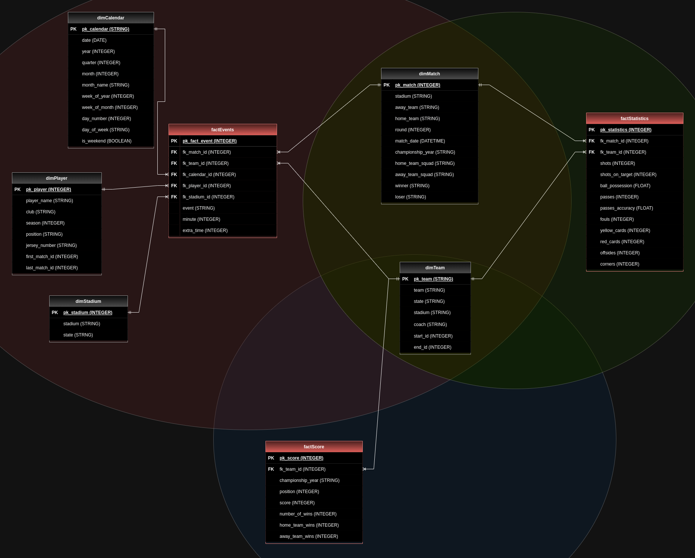
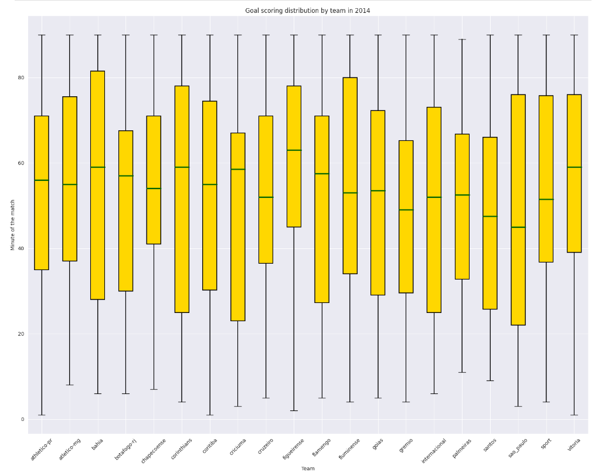

# Brazilian Soccer Championship Analysis
## Summary
> O que é
> 
> O que foi usado (ferramentas e conceitos)
>
> Funções de cada um no projeto

This project aims to analyze the Brazilian Soccer Championship, also known as "Brasileirão", which is the top-tier professional football league in Brazil. The analysis is based on the historical data of the championship, including match results, player statistics, and other relevant factors.

The project was divided into 3 steps:

1. Data Selection
2. Data Manipulation
3. Data Analysis and Vizualization

 

# 1. Data Selection  
The first step consisted of selecting the datasets to be used in the project. The ones we choose are available [here](https://www.kaggle.com/datasets/adaoduque/campeonato-brasileiro-de-futebol).
After the dataset was selected, it was loaded into Google Sheets for a preliminary verification of data quality and to ensure uniform formatting.

With the initials adjustments done, the tables were lodaded into BigQuery as "raw" tables (bronze layer) to begin the massive transformations.

 

# 2. Data Manipulation  
In the second step, our objective was to build a data warehouse architecture and model all the raw data that had been extracted. The structure was designed based on 3 data marts.

- The main data mart stores the data about events in each match. It comprises a transactional table named `factEvents` and five additional dimensions: `dimMatch`, `dimPlayer`, `dimStadium`, `dimTeam` and `dimCalendar`.
- The second data mart contains data regarding match statistics, with a central table named `factStatistics` that relates to `dimTeam` and `dimMatch`.
- The third and final data mart records the final score table for each year and the main table `factScore` is also related to `dimTeam`.

Subsequently, the ETL process as well as the final tables will be presented in a detailed manner below.

*ERD of brasileirao championship data model*

 

The entire model is represented [here](https://drive.google.com/file/d/1ejlKub_w4EP8wMyLYU0ykyO7PT3yaIc9/view?usp=sharing).

### ETL process
After the completion of the extraction phase, the data transformation step was initiated. For this stage, an ETL process was developed using SQL to establish the data warehousing solution. Given the structure of the raw data, the dimensional modeling "star schema" was chosen as the optimal option to address the business questions.

For data storage and the execution of all transformation steps, the BigQuery platform was employed. Within BigQuery, three layers were created to process the data according to the phase and data application.

👉 **Bronze layer**: This layer contains raw tables from Google Sheets files.

👉 **Silver layer**: This layer contains two intermediary tables used specifically on the `dimPlayer` creation process.

👉 **Gold layer**: This layer contains the final data warehouse tables (fact-s and dim´s) with curated data ready to be used.

@TODO [UM DESENHO DO PROCESSO DE ETL]

@TODO [FALAR SOBRE OS ACESSOS AO BIGQUERY - TABELAS DO DW E QUERIES]

@TODO: [FAZER IMAGEM DE SCHEMA]

@TODO: [COLOCAR IMAGENS DAS TABELAS]

### Data model
As mentioned earlier, the model consists of 3 fact tables and 5 dimensional tables that are related to each other through a star schema modeling across 3 data marts. Subsequently, a detailed explanation of each table stored in the data warehouse will follow.

⚽ `dimMatch`: Information about the matches such as the winner team, stadium and match date.

🏃🏽‍♂️ `dimPlayer`: Table containing data about each identified player. 'Player_name', 'Position' and 'Jersey_number' are some of the columns in this table.

🏟 `dimStadium`: Store data about the stadium names and locations.

🛡 `dimTeam`: This is one of the tables that uses Slowly Changing Dimensions (SCD) due to coach changes over time.

📅 `dimCalendar`: The last dimension is a table that stores date-related data for time-based analysis.

🥅 `factEvents`: This is the main table table in the model. It´s related to all dimensional tables and store all the goals, red cards and yellow cards and when they occurred.

🔢 `factStatistics`: Some statistical reports can be extracted from here, such as ball possession, passing accuracy and offsides.

🏅 `factScore`: The third fact table store the final league position and score, as well as the number of wins separated by home and away matches.

### Slowly Changing Dimensions (SCD)

In this project, some information exhibited a historical behavior, necessitating the storage of not only the latest data, but also all the information from the past associated with the analyzed instance. For this reason, SCD technique was applied in two dimensional tables, `dimTeam`and `dimPlayer`. Before explaining how SCD was applied, it is interesting to briefly define what the concept means. 

"Slowly Changing Dimension" is used in data modeling to structure how information evolves over time within a data warehouse or business intelligence system. The first decision to be made is determining how historical information in data will be maintained so that analyses can accurately reflect the reality over time. There are basically three main types of SCDs:

- SCD Type 1 - Overwrite:

In this type, old information is simply replaced with new information when an update occurs. This means that historical data is not preserved, and only the most recent version of the data is retained.

- SCD Type 2 - Add a New Row:

In this type, a new record is added whenever a change in data occurs. This means that you maintain a history of all changes.
To track the historical data, additional columns like 'start_date' and 'end_date' are crated to keep up with the changes over time.

- SCD Type 3 - Add History Fields:

In this type, an intermediate approach is used. Instead of maintaining a complete history of all changes, only specific fields are kept to track the most recent changes.

Given the possibility to hold all the historical data, as well as the appliance in multiple scenarios, the better fit for the project was 'SCD Type 2'. As highlighted earlier, two tables store historical data:

🛡 `dimTeam`: The columns 'start_date' and 'end_date' were transformed into 'start_id' and 'end_id' since the data source used was based on the matches and their IDs. This makes it possible to specifically identify the coach in charge in a particular match.

🏃🏽‍♂️ `dimPlayer`: In this table, the time reference was also the match ID, and the data source was mainly the silver layer tables. The historical informations tha can be found includes the player's specific jersey number, position, and club in a given match.

 

# 3. Data Analysis and Vizualization
In the third phase of the project, the data analysis itself was made using the data model that had been created previously.

To do that was raised some hyphotesis to be validated outputting on acceptance or rejection. 

About the hypothesis, some that are highlighted are:

- 📌 *Home teams win more frequently*
- 📌 *Home teams receive fewer cards*
- 📌 *Teams with an expelled player in the first half have more chance to lose the game*
- 📌 *Champions teams have more pass accuracy*
- 📌 *The matches of the second turn have more events (goals and cards) than the matches of the first*

To accomplish the analysis, some ETL processes were, all of them written in Python, using Google Colab as the processing tool, and to get the data, a direct connection between Colab and BigQuery was made using its native integration.

> 📘 **_Google Colab_ was chosen because of its easy connection between notebooks and BigQuery, being the latter where the data is.**

Below are the notebooks used to do the data analysis:

- [Home teams win more frequently](https://github.com/igoravelli/brazilian_soccer_championship_analysis/blob/readme-file/Win_frequency_in_home_matches.ipynb)
- [Home teams receive fewer cards](https://github.com/igoravelli/brazilian_soccer_championship_analysis/blob/main/Average_of_cards_in_home_team_matches.ipynb)
- [Teams with an expelled player in the first half have more chance to lose the game](https://github.com/igoravelli/brazilian_soccer_championship_analysis/blob/main/Number_of_matches_with_expelled_players.ipynb)
- [Champions teams have more pass accuracy](https://github.com/igoravelli/brazilian_soccer_championship_analysis/blob/main/Teams_accuracy_pass.ipynb)
- [The matches of the second turn have more events (goals and cards) than the matches of the first](https://github.com/igoravelli/brazilian_soccer_championship_analysis/blob/main/Events_frequency_along_the_turns_.ipynb)

⏩ There is a conclusion of the analysis by the end of each notebook

 

Besides the hypothesis mentioned before, also was proposed the following discussion:
> 📢 Is there a pattern about when (during the game) each winning team scores? Does the landscape change when the winner is the home team?
> 
> 🔎 [notebook with the analysis](https://github.com/igoravelli/brazilian_soccer_championship_analysis/blob/main/Goal_scoring_distribution_by_team.ipynb)
>
> As an output of this discussion, the following chart shows the goals score distribution throughout the match by team in 2014.
> 
> 
> *goals score distribution throughout the match by team in 2014*

 

# References
KIMBALL, Ralph. The data warehouse toolkit: practical techniques for building dimensional data warehouses. John Wiley & Sons, Inc., 1996.

MUNZNER, Tamara et al. Exploratory data analysis.

Google Cloud. (2023). Google BigQuery Documentation. Retrieved from (https://cloud.google.com/bigquery/docs)

Google. (2023). Google Colab Documentation. Retrieved from (https://colab.research.google.com/notebooks/intro.ipynb)
